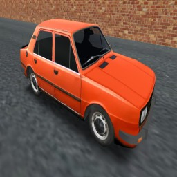
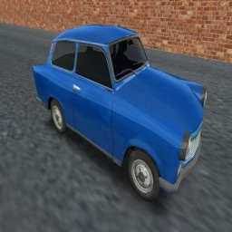
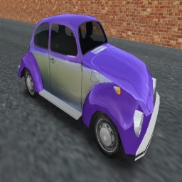
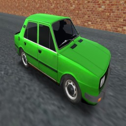
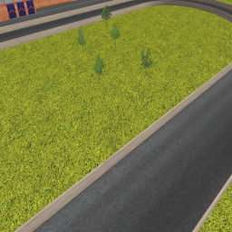
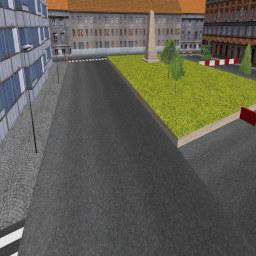
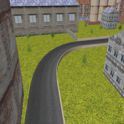
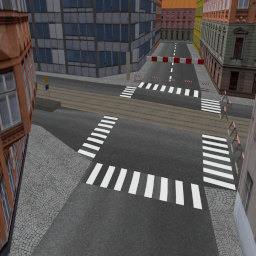

# OpenMRac-data
   

    

Game data for [OpenMRac](https://github.com/Franticware/OpenMRac) created by [Vojtěch](https://www.franticware.com/) and [Michal](https://mrkvon.org) Salajka.

In case of usage of any of these resources, a credit is appreciated, but not required as per the CC0 license.

Additional Public Domain resources were used:  
http://tulrich.com/fonts/  
https://opengameart.org/content/real-asphalt-texture-pack  
https://opengameart.org/content/synthetic-grass-texture-pack  
https://opengameart.org/content/free-urban-textures-fences
